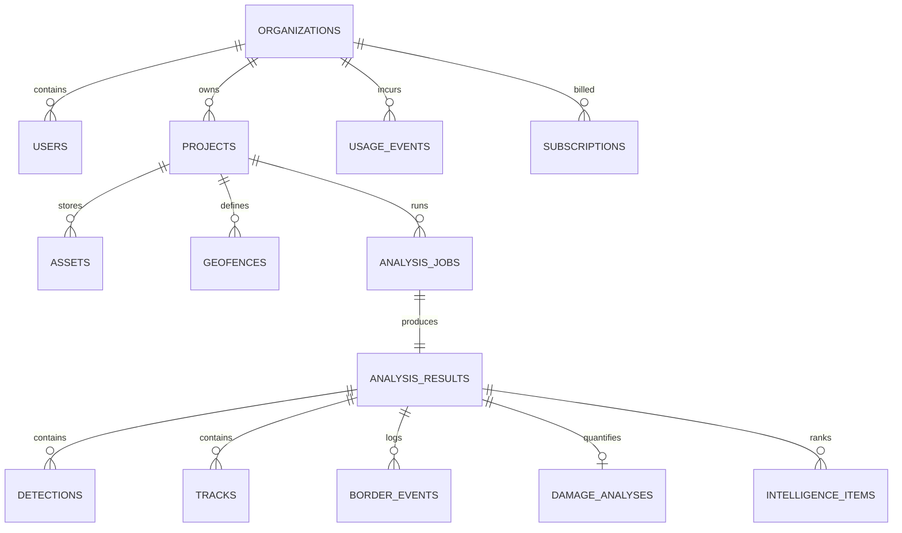

# AERION — Comprehensive System Architecture Specification

**Document Version**: 2.3.0  
**Phase**: Phase 2.3 — Operational Intelligence + Situation Engine Architecture  
**Status**: DESIGN SPECIFICATION ONLY (NO BACKEND/DATABASE CODE IMPLEMENTED YET)  
**Baseline Git Commit**: `c3ab984`  
**Repository**: `https://github.com/AVIRAL017/AERION.git`  
**Target Milestone**: Phase 3A Backend Foundation (FastAPI + PostgreSQL/PostGIS) Preparation  

---

## 1. System Overview

AERION is an enterprise multi-modal situational awareness and geospatial intelligence platform tailored for two specialized operational domains:
1. **Disaster Response & Structural Assessment Mode**: Quantifying infrastructure destruction, building damage, and terrain displacement using high-resolution bi-temporal satellite and aerial imagery, calculating live/historical environmental constraints, evaluating real road-network evacuation routes, and shelter capacities.
2. **Border Security & Geofence Surveillance Mode**: Real-time multi-target tracking, automated geofence boundary monitoring, motion trajectory vector calculation, dwell analysis, deterministic sector vulnerability scoring, environmental sensor crossover analysis, and potential unauthorized-crossing indicators.

The platform employs a decoupled layered architecture spanning:
* A strictly frozen, cryptographically verified Machine Learning Runtime layer.
* An in-memory Python Normalization and Unified Contract layer (Phase 1).
* An atomic **Evidence Layer** generating immutable `EvidenceRecord` items from real detections, sensor telemetry, and verified external providers (Phase 2.3).
* A deterministic **Situation Engine** maintaining mutable operational state and an append-only event log (Phase 2.3).
* An **External Provider Integration Layer** for real-world meteorological data, road network graph routing, shelter registries, and vector map tiles (Phase 2.3).
* A controlled Application Service and Runtime Management layer (Phase 3 planned).
* A relational, spatial, and time-series Persistence layer (PostgreSQL + PostGIS, Phase 3 planned).
* A scalable Object Storage layer (S3-compatible, Phase 3 planned).
* A strictly bounded **Mistral AI Advisory Layer** generating operator narratives from deterministic report facts (Phase 2.3).
* A secure API boundary supporting CORS, authentication, authorization, usage metering, and subscription entitlements (Phase 3 planned).
* A high-performance Web Operations Dashboard (Next.js, Phase 4 future).

```
+---------------------------------------------------------------------------------------------------+
|                                 AERION SYSTEM ARCHITECTURE MAP                                    |
+---------------------------------------------------------------------------------------------------+
|  [PRESENTATION LAYER] (Phase 4 Future)                                                            |
|  Next.js 15 App Router | Mapbox GL / MapLibre | WebSockets / SSE | Tactical Layer Collections     |
+---------------------------------------------------------------------------------------------------+
                                                  | HTTPS / WSS
                                                  v
+---------------------------------------------------------------------------------------------------+
|  [API & GATEWAY LAYER] (Phase 3 Planned)                                                          |
|  FastAPI Gateway | Security Middleware | Auth (JWT) | RBAC | Entitlement Guard | Situation Router |
+---------------------------------------------------------------------------------------------------+
                                                  |
                                                  v
+---------------------------------------------------------------------------------------------------+
|  [APPLICATION & SERVICE LAYER] (Phase 3 Planned)                                                  |
|  Mission Service | Asset Manager | Geofence Service | Billing Service                             |
|  Controlled Job Execution: In-Process Execution / BackgroundTasks (Phase 3 Planned)               |
+---------------------------------------------------------------------------------------------------+
        |                                       |                                    |
        v                                       v                                    v
+---------------------------------+  +-------------------------------+  +--------------------------+
|   [EVIDENCE & SITUATION LAYER]  |  | [EXTERNAL PROVIDERS LAYER]    |  | [MISTRAL AI ADVISORY]    |
|   (Phase 2.3 Architectural Core)|  | - Weather (Open-Meteo API)    |  | - open-mistral-nemo      |
| - Canonical Evidence Layer      |  | - Routing (OpenRouteService)  |  | - Bounded 5-6 sentence   |
| - Situation Engine (State/Log)  |  | - Map Tiles (Mapbox / OSM)    |  |   tactical/civil advisory|
| - Sector Vulnerability Engine   |  | - Shelter Registry            |  | - NO fabricated facts    |
| - Evacuation Routing Engine     |  | - Elevation API               |  | - NO direct score calc   |
+---------------------------------+  +-------------------------------+  +--------------------------+
        |                                                                            |
        +----------------------------+-----------------------------------------------+
                                     |
                                     v
+---------------------------------------+   +-------------------------------------------------------+
|  [ML RUNTIME LAYER] (Phase 1 CURRENT) |   |  [DATA & STORAGE LAYER] (Phase 3 Planned)             |
|  aerion_orchestrator.py               |   |  - PostgreSQL 16 + PostGIS 3.4 (Relational + Spatial) |
|  aerion_runtime_normalizer.py         |   |  - Evidence, Situations, Events, Reports, Shelters   |
|  aerion_runtime_contracts.py          |   |  - Object Storage (AWS S3 / MinIO for GeoTIFF/MP4)    |
|  -----------------------------------  |   |  - Separate Image Pixel vs WGS84 Spatial Columns      |
|  [FROZEN ML ENGINES] (Phase 0 FROZEN) |   +-------------------------------------------------------+
|  - VisDrone YOLOv8s (1280px)          |
|  - Unified Drone YOLOv8s (1280px)     |
|  - Satellite YOLOv8n-OBB (1024px)     |
|  - Siamese ResNet18 Damage (512px)    |
+---------------------------------------+
```

---

## 2. Operational Profiles

### 2.1 Disaster Mode
* **Primary Objective**: Rapid disaster extent mapping, structural triage, and emergency response coordination.
* **Core Inputs**:
  * Dual-temporal satellite/aerial images (pre-event and post-event RGB imagery).
  * Static nadir drone surveys of disaster zones.
* **Processing Pipeline**:
  1. Image registration check and tile slicing (`512x512` patches).
  2. Siamese ResNet18 feature subtraction across dual encoder streams.
  3. U-Net skip-decoder logit map emission.
  4. Binary thresholding at `0.50` generating structural damage masks.
  5. Local Structural Similarity Index (SSIM) matrix subtraction against background terrain.
  6. Deterministic priority computation: `Priority = 0.5 * (weight * conf) + 0.5 * change_signal`.
  7. Advisory incident protocol retrieval from [`protocols.py`](protocols.py).
* **Target Outputs**: Damage ratio, total damaged pixel count, geo-referenced polygon damage masks, priority tiering (`Critical`, `High`, `Medium`, `Low`), and operator advisory reports.

### 2.2 Border Security Mode
* **Primary Objective**: Automated restricted zone intrusion detection, vehicle classification, and perimeter threat evaluation.
* **Core Inputs**:
  * High-resolution video streams (RTSP feeds or sequential video files).
  * Configured geofence polygons (closed 2D spatial boundaries).
  * Operator terrain context metadata (`arid`, `coastal`, `mountain`, `forest`).
* **Processing Pipeline**:
  1. Frame ingestion via bounded threaded buffer ([`LiveVideoInput`](live_video_input.py)).
  2. Aerial object perception via frozen YOLOv8s (`visdrone_only` or `unified`).
  3. Multi-object trajectory tracking using ByteTrack ([`BorderTracker`](border_tracking.py)).
  4. Ray-casting point-in-polygon containment test ([`BorderZoneAnalyzer`](border_zone.py)).
  5. Distance-to-boundary projection and approach vector dot-product calculation.
  6. Motion threat calculation incorporating dwell time and inside movement ([`BorderIntelligence`](border_intelligence.py)).
  7. Threat suppression filter eliminating diverging movements and enforcing cooldown intervals ([`BorderEventFilter`](border_event_filter.py)).
* **Target Outputs**: Active tracks with unique IDs, centroid positions, motion direction, geofence status (`INSIDE`/`OUTSIDE`), intrusion alert flags, and composite activity scores.

---

## 3. Implementation State Taxonomy

To maintain absolute technical honesty and prevent claiming unvalidated operational capabilities, all platform components are strictly classified under four distinct states:

* **`[IMPLEMENTED AND VALIDATED]`**: Fully implemented, passing automated tests at baseline commit `c3ab984`:
  * Frozen ML models: VisDrone YOLOv8s (1280px), Unified YOLOv8s (1280px), DOTA-v1.5 YOLOv8n-OBB (1024px), Siamese ResNet18 (512px).
  * Low-level inference adapters: `drone_detector.py`, `satellite_detector.py`, `damage_inference.py`, `border_pipeline.py`.
  * Spatial tracking & geometric analytics: ByteTrack in pixel space, 2D ray-casting point-in-polygon containment, background SSIM structural change subtraction.
  * Unified in-memory contracts & normalizers: `aerion_runtime_contracts.py`, `aerion_runtime_normalizer.py`, `aerion_orchestrator.py`.
  * Automated verification: 26 unit and real integration tests in `tests/runtime/`.

* **`[ARCHITECTURALLY DEFINED]`**: Thoroughly specified in formal contracts and schemas, pending implementation in scheduled backend phases:
  * Canonical Evidence Layer (`EvidenceRecord` provenance tracking).
  * Situation Engine (`SituationState`, `SituationEvent` immutable log).
  * Bounded Mistral AI advisory generation (5-6 sentences, temperature 0.20).
  * Strict coordinate separation architecture (Pixel space vs PostGIS WGS84).
  * PostgreSQL 16 + PostGIS relational/spatial schema (19 entities).
  * RESTful and WebSocket API endpoints under `/api/v1`.

* **`[REQUIRES EXTERNAL DATA]`**: Architecturally designed, but dependent on external data and credentials collected independently by the operator:
  * Meteorological / weather feeds (Open-Meteo API credentials/endpoint).
  * Road network topological graph routing (OpenRouteService credentials/endpoint).
  * Vector and satellite map tiles (Mapbox token/credentials).
  * Civil protection emergency shelter registries, capacity, and real-time availability (authoritative municipality datasets).
  * Spatial hazard polygons and flood perimeters (India flood data, NDMA/CWC feeds).
  * Real-time road blockage feeds (external traffic / transport feeds).
  * Live drone telemetry (autopilot/MAVLink GPS, altitude, gimbal attitude for georeferencing).
  * Calibrated georeferenced imagery containing embedded CRS / transform matrices.
  * Digital Elevation Models (DEM) rasters (Copernicus / SRTM for slope and line-of-sight terrain intelligence).

* **`[FUTURE / NOT IMPLEMENTED]`**: Long-term conceptual extensions that are NOT implemented, NOT validated, and must NEVER be treated as operational fallbacks:
  * **Visual odometry navigation fallback**: No optical flow or inertial SLAM pipeline exists.
  * **Thermal / Infrared (IR) crossover & radiometry analysis**: Requires calibrated thermal camera hardware and radiometry pipeline.
  * **Automated RGB terrain intelligence without external DEM**: Terrain slope and line-of-sight cannot be inferred from RGB images alone.
  * **Longitudinal historical incident recurrence modeling**: Requires months of accumulated operational mission data in PostgreSQL.
  * **Hardware-level GPS spoofing / jamming detection**: Requires dedicated multi-constellation RF hardware.
  * **Local vLLM / self-hosted Mistral 7B inference server**: Deferred; Phase 3 uses hosted Mistral API with `open-mistral-nemo`.
  * **Distributed Celery + Redis GPU worker clusters**: Deferred to horizontal production scaling (Phase 4+).
  * **Production payment gateway recurring billing**: Deferred to commercial deployment.

---

## 4. Layer-by-Layer Architectural Decomposition

### 4.1 ML Runtime Layer `[CURRENT]`
* **Status**: Complete, operational, and frozen.
* **Components**:
  * Frozen weights: `visdrone_8s_1280_30ep`, `unified_drone_20ep`, `train-6/best.pt` (OBB), `best_model.pth` (Siamese ResNet18).
  * Low-level inference adapters: [`drone_detector.py`](drone_detector.py), [`satellite_detector.py`](satellite_detector.py), [`damage_inference.py`](damage_inference.py), [`border_pipeline.py`](border_pipeline.py).
  * Deterministic scoring & advisory: [`intelligence_engine.py`](intelligence_engine.py), [`protocols.py`](protocols.py), [`report_generator.py`](report_generator.py).
  * Unified abstraction: [`aerion_orchestrator.py`](aerion_orchestrator.py), [`aerion_runtime_normalizer.py`](aerion_runtime_normalizer.py), [`aerion_runtime_contracts.py`](aerion_runtime_contracts.py).
* **Memory & Lifecycle Guarantees**:
  * Lazy loading enforced to ensure models are loaded into VRAM only when their specific pipeline is called.
  * In-memory outputs conform strictly to standard Python dictionaries and dataclasses without leaking tensor or array references.

### 4.2 Application & Service Layer `[PLANNED - PHASE 3]`
* **Status**: Architectural design complete; code implementation deferred to Phase 3.
* **Core Philosophy**: Initial Phase 3 architecture prioritizes simplicity, stability, and zero unnecessary overhead:
  `FastAPI + AERION Application Service + PostgreSQL/PostGIS + AERION Runtime`.
* **Controlled Job Execution**:
  * **Phase 3 Baseline**: Simple, controlled in-process execution (synchronous calls or FastAPI `BackgroundTasks`) with serialized GPU access to prevent VRAM exhaustion on local hardware (RTX 3050 6 GB).
  * **[OPTIONAL / FUTURE SCALING COMPONENT]**: Distributed queue + worker architecture (Redis + Celery) is deferred to future production scaling when multi-worker concurrent workloads justify external queue infrastructure.
* **Responsibilities**:
  * **Mission Service**: Coordinates mission creation, status transitions, and binds operational parameters (mode, terrain, geofences).
  * **Asset Service**: Validates file MIME types, dimensions, pre-computes image hashes, and generates pre-signed upload/download URLs.
  * **Runtime Manager**: Controls lazy model loading into GPU memory, runs inference, normalizes results, and enforces explicit memory release policies.
  * **Geofence Service**: Manages both pixel-space polygons (for camera feeds) and geospatial polygons (for georeferenced maps), ensuring topological validity.
  * **Intelligence Service**: Mediates deterministic threat prioritization and optional LLM advisory generation.

### 4.3 Persistence Layer `[PLANNED - PHASE 3]`
* **Engine**: PostgreSQL 16 + PostGIS 3.4.
* **Responsibilities**:
  * ACID-compliant storage of system metadata, user accounts, organizations, and subscription states.
  * Relational storage of missions, assets, jobs, and discrete detection events.
  * **Strict Coordinate Separation**: Separate columns for Image/Pixel space (`pixel_bbox`, `pixel_polygon`, `pixel_center`) versus Geospatial space (`geom_point_4326`, `geom_polygon_4326`). Pixel coordinates and WGS84 coordinates are NEVER mixed inside a single geometry column.
  * High-performance spatial indexing (`GIST`) strictly on georeferenced WGS84 columns (`geom_polygon_4326`, `geom_point_4326`).
  * Time-series indexing (`BTREE`) for alert queries, tracking logs, and monthly usage events.
* **Storage Boundaries**:
  * Binary model files, high-resolution GeoTIFFs, and video streams are **never** stored directly in PostgreSQL. Only object keys, metadata, and derived bounding vectors are stored.

### 4.4 Object Storage Layer `[PLANNED - PHASE 3]`
* **Engine**: S3-compatible object store (Local: MinIO / Production: AWS S3).
* **Storage Hierarchy**:
  ```text
  aerion-storage/
  ├── raw/
  │   ├── {org_id}/{project_id}/images/{asset_id}.jpg
  │   ├── {org_id}/{project_id}/videos/{asset_id}.mp4
  │   └── {org_id}/{project_id}/pairs/{asset_id}_pre.png
  ├── processed/
  │   ├── {org_id}/{project_id}/masks/{job_id}_damage_mask.png
  │   ├── {org_id}/{project_id}/annotated/{job_id}_render.mp4
  │   └── {org_id}/{project_id}/crops/{job_id}_{track_id}.jpg
  └── reports/
      └── {org_id}/{project_id}/advisory_{analysis_id}.json
  ```

### 4.5 API Layer `[PLANNED - PHASE 3]`
* **Engine**: FastAPI (Python 3.13) running on Uvicorn with Gunicorn process workers.
* **Design Standards**:
  * RESTful JSON APIs adhering strictly to OpenAPI 3.1 standards.
  * Unified response envelope: `{ "success": bool, "data": Any, "error": Optional[ErrorDetail], "meta": Dict }`.
  * Streaming endpoints: Server-Sent Events (SSE) for job status progression and WebSockets for real-time video frame alerts.

### 4.6 Presentation Layer `[FUTURE - PHASE 4+]`
* **Engine**: Next.js 15 (React 19) deployed to Vercel.
* **Features**:
  * WebGL/WebGPU accelerated mapping (MapLibre GL) supporting vector tiles, satellite imagery layers, and geofence drawing.
  * Low-latency video canvas rendering synchronized with WebSocket detection overlays.
  * Mission timeline and threat alert feed with manual incident verification controls.

---

## 5. Service Boundaries & Ownership Matrix

| Service Boundary | Owns | Does NOT Own |
| :--- | :--- | :--- |
| **AERION Runtime** | Model weight execution, raw detection inference, ByteTrack Kalman filtering, ray-casting geometry, SSIM matrix difference, unified contract serialization. | HTTP routing, user authentication, database persistence, cloud storage operations, credit billing, user permissions. |
| **AERION Evidence Layer** | Immutable `EvidenceRecord` creation, provenance tracking, coordinate reference tagging (pixel vs EPSG:4326), epistemological modality labeling (`OBSERVED`, `DERIVED`, `EXTERNALLY_PROVIDED`). | Machine learning inference, state mutation, user authentication, direct database persistence. |
| **AERION Situation Engine** | Mutable `SituationState` maintenance, causal event evaluation (`SituationEvent`), sector vulnerability scoring, evacuation route feasibility assessment, degraded mode flags. | Raw model execution, long-term persistence, user identity, credit metering. |
| **AERION Application** | Business workflows, multi-step job pipelines, parameter aggregation, dispatching worker tasks, coordinating runtime calls. | Raw matrix math, deep learning tensor graphs, direct SQL execution, password hashing. |
| **AERION Persistence** | Database schema, relational integrity, foreign key cascading, PostGIS spatial queries, indexing, query optimization. | Image decoding, video decoding, filesystem caching, billing rule computation. |
| **AERION Storage** | Object lifecycle rules, multipart uploads, pre-signed URL generation, content-type verification, cloud bucket permissions. | Relational queries, spatial queries, job scheduling. |
| **External Providers** | External authoritative data feeds (Open-Meteo weather, OpenRouteService road graphs, Mapbox vector tiles, Shelter registries). | Internal system state, detection processing, scoring algorithms. |
| **Mistral AI Advisory** | Natural language synthesis of deterministic situation facts into concise 5-6 sentence executive advisories. | Risk calculation, detection identification, coordinate generation, event logging, truth determination. |
| **AERION Authentication** | User identity, password verification (Argon2id), JWT issuance and revocation, session refresh tokens. | Role-based permission checks, subscription limits, model inference. |
| **AERION Authorization** | RBAC permission evaluation (`admin`, `operator`, `analyst`), project membership validation, asset ownership verification. | Identity authentication, credit balances, model invocation. |
| **AERION Usage Meter** | Recording auditable usage events (image count, video minutes, RAG requests), tracking quota consumption. | Enforcing plan upgrades, processing payments, executing ML jobs. |
| **AERION Subscription** | Plan tier definitions (`FREE`, `PRO`), quota entitlement validation, feature flag toggling. | Storing detection results, calculating threat scores, issuing JWTs. |
| **AERION API** | HTTP routing, request payload validation, status codes, OpenAPI schemas, rate limiting, error serialization. | ML algorithms, database connection pooling, persistent file storage. |
| **AERION Frontend** | User interface rendering, interactive geofence polygon drawing, WebGL map layers, local state caching. | Authoritative threat scoring, ground truth validation, private keys. |

---

## 6. Authoritative Scoring & Prioritization Contract

### 6.1 Threshold Divergence Resolution
During Phase 0, a discrepancy was identified between:
* Legacy script [`priority_scoring.py`](priority_scoring.py): `Critical >= 0.70`, `High >= 0.40`, `Medium >= 0.20`, `Low < 0.20`.
* Primary engine [`intelligence_engine.py`](intelligence_engine.py): `Critical >= 0.75`, `High >= 0.50`, `Medium >= 0.25`, `Low < 0.25`.
* Official ML Verification Manifest: `test_results/aerion_v1_ml_verification_manifest.json` specifies `0.75 / 0.50 / 0.25`.

**Authoritative Decision**:
The official AERION v1 scoring contract follows [`intelligence_engine.py`](intelligence_engine.py) and the official ML Verification Manifest:
* **Critical**: $\ge 0.75$
* **High**: $\ge 0.50$ and $< 0.75$
* **Medium**: $\ge 0.25$ and $< 0.50$
* **Low**: $< 0.25$

`priority_scoring.py` is cataloged as legacy technical debt and must not be used in production services.

### 6.2 Mathematical Scoring Formulations

#### 1. Perception & Structural Change Formula
For static imagery and disaster damage assessments:
$$\text{Priority Score} = 0.5 \cdot (\text{Class Weight} \cdot \text{Confidence}) + 0.5 \cdot \text{Change Score}$$
Where:
$$\text{Change Score} = \max\left(0.0, \min\left(1.0, \frac{\text{Background SSIM} - \text{Local SSIM}}{\text{Background SSIM}}\right)\right)$$
If background SSIM is unavailable, change contribution defaults to $0.0$.

#### 2. Border Surveillance Activity Formula
For real-time perimeter tracking:
$$\text{Border Score} = \sum (W_i \cdot S_i)$$
* Zone Entry Breach ($W = 0.40$)
* Approach Vector toward Geofence ($W = 0.15$)
* Target Velocity / Movement ($W = 0.15$)
* Track Persistence ($W = 0.10$)
* Trajectory Movement Inside Zone ($W = 0.10$)
* Detection Confidence ($W = 0.05$)
* Zone Dwell Duration ($W = 0.05$)

---

## 7. Configuration Architecture (`AERION_CONFIG`)

Configuration is managed hierarchically via Pydantic Settings models reading strictly from environment variables.

### 7.1 Configuration Groups
```python
class ProjectConfig(BaseModel):
    PROJECT_NAME: str = "AERION"
    PROJECT_VERSION: str = "v1"
    ENVIRONMENT: str = "development"  # "development", "staging", "production"
    DEBUG: bool = False

class ModelConfig(BaseModel):
    # Local Windows defaults mapping to containerized Linux paths in production
    DRONE_VISDRONE_PATH: str = r"D:\mp-1\runs\detect\visdrone_8s_1280_30ep\weights\best.pt"
    DRONE_UNIFIED_PATH: str = r"D:\mp-1\runs\detect\unified_drone_20ep\weights\best.pt"
    SATELLITE_OBB_PATH: str = r"D:\mp-1\runs\obb\train-6\weights\best.pt"
    DAMAGE_MODEL_PATH: str = r"D:\mp-1\change_detection_runs_v2\best_model.pth"

class RuntimeConfig(BaseModel):
    DEVICE: str = "0"  # GPU device ID or "cpu"
    CONFIDENCE_THRESHOLD: float = 0.25
    IOU_THRESHOLD: float = 0.50
    DAMAGE_THRESHOLD: float = 0.50
    LAZY_LOAD_MODELS: bool = True

class DatabaseConfig(BaseModel):
    POSTGRES_HOST: str = "localhost"
    POSTGRES_PORT: int = 5432
    POSTGRES_DB: str = "aerion_db"
    POSTGRES_USER: str = "aerion_user"
    POSTGRES_PASSWORD: str = ""
    POSTGRES_SSL_MODE: str = "prefer"
    DATABASE_POOL_SIZE: int = 20

class StorageConfig(BaseModel):
    STORAGE_BACKEND: str = "local"  # "local", "s3", "minio"
    STORAGE_LOCAL_ROOT: str = r"D:\mp-1\storage"
    S3_ENDPOINT_URL: Optional[str] = None
    S3_BUCKET_NAME: str = "aerion-data"
    S3_ACCESS_KEY: Optional[str] = None
    S3_SECRET_KEY: Optional[str] = None
    S3_REGION: str = "us-east-1"

class AIConfig(BaseModel):
    MISTRAL_API_KEY: Optional[str] = None
    MISTRAL_MODEL: str = "open-mistral-nemo"
    MISTRAL_TIMEOUT: int = 60
    ENABLE_ADVISORY_REPORTS: bool = True

class SubscriptionConfig(BaseModel):
    PLAN_FREE_NAME: str = "FREE"
    PLAN_PRO_NAME: str = "PRO"
    PLAN_PRO_PRICE_INR: int = 9  # Configurable pricing model

class SecurityConfig(BaseModel):
    RATE_LIMIT_BACKEND: str = "memory"  # "memory" (dev baseline), "redis" (optional future scaling)
    RATE_LIMIT_DEFAULT: str = "100/minute"
    RATE_LIMIT_INFERENCE: str = "10/minute"
    CORS_ALLOWED_ORIGINS: List[str] = ["http://localhost:3000"]

class ExternalProviderConfig(BaseModel):
    MAPBOX_ACCESS_TOKEN: Optional[str] = None
    OPENROUTESERVICE_API_KEY: Optional[str] = None
    WEATHER_API_KEY: Optional[str] = None
    WEATHER_API_BASE_URL: str = "https://api.open-meteo.com/v1"
    ELEVATION_API_BASE_URL: str = "https://api.open-elevation.com/api/v1"
```

> [!NOTE]
> **Rate Limiting Security Abstraction**:
> Phase 3A security introduces an abstract `RateLimiter` interface with an initial development-safe in-memory token-bucket / sliding window implementation. Redis is **NOT** a mandatory prerequisite for Phase 3A security. A Redis-backed implementation can be introduced later when Redis is actually adopted. Security must remain mandatory; Redis itself does not.

### 7.2 Path Mapping (Local Windows to AWS Cloud)
Local file paths (`D:\mp-1\...`) will map cleanly in Phase 3 by introducing an environment variable path resolver:
* Local: `D:\mp-1\runs\detect\visdrone_8s_1280_30ep\weights\best.pt`
* Container / AWS: `/opt/aerion/models/runs/detect/visdrone_8s_1280_30ep/weights/best.pt`

### 7.3 Secret Management Architecture
* **Strict Confidentiality Invariant**:
  * The local `.env` file contains sensitive local credentials (including `MISTRAL_API_KEY`).
  * The `.env` file MUST remain **local-only**, strictly listed in `.gitignore`, **never committed** to Git, **never embedded** in source code, and **never printed** in application logs, error traces, or API responses.
  * The Mistral API key (or any third-party credential) must **never be hardcoded** anywhere in the codebase.
* **Architecture Progression**:
  * **LOCAL DEVELOPMENT `[CURRENT]`**:
    ```text
    Local .env (Untracked)
           ↓
    OS Environment Variables
           ↓
    Pydantic Settings (`AERION_CONFIG.ai.MISTRAL_API_KEY`)
           ↓
    Application Service (Injected on demand)
    ```
  * **FUTURE PRODUCTION `[PHASE 4+]`**:
    ```text
    Cloud Secret Store (AWS Secrets Manager / HashiCorp Vault / KMS)
           ↓
    Container Runtime Environment Injection (ECS Task Secrets)
           ↓
    Pydantic Settings
           ↓
    Application Service
    ```
  * **Implementation Scope**: Do **NOT** implement AWS Secrets Manager or external vault connections during Phase 2.1 or initial Phase 3. The immediate Phase 3 baseline relies on OS environment variables parsed safely through Pydantic without ever echoing secrets.

---

## 8. Database Architecture (PostgreSQL + PostGIS)



### 8.1 Core Entities & Schema Specifications

#### 1. `organizations`
* `id`: UUID (Primary Key)
* `name`: VARCHAR(255) NOT NULL
* `slug`: VARCHAR(100) UNIQUE NOT NULL
* `created_at`: TIMESTAMPTZ DEFAULT NOW()

#### 2. `users`
* `id`: UUID (Primary Key)
* `organization_id`: UUID (FK -> `organizations.id`)
* `email`: VARCHAR(255) UNIQUE NOT NULL
* `hashed_password`: VARCHAR(255) NOT NULL
* `role`: VARCHAR(50) DEFAULT 'operator'  # 'admin', 'operator', 'analyst'
* `is_active`: BOOLEAN DEFAULT TRUE
* `created_at`: TIMESTAMPTZ DEFAULT NOW()

#### 3. `projects`
* `id`: UUID (Primary Key)
* `organization_id`: UUID (FK -> `organizations.id`)
* `name`: VARCHAR(255) NOT NULL
* `mode`: VARCHAR(50) NOT NULL  # 'disaster', 'border'
* `created_at`: TIMESTAMPTZ DEFAULT NOW()

#### 4. `assets`
* `id`: UUID (Primary Key)
* `project_id`: UUID (FK -> `projects.id`)
* `storage_key`: VARCHAR(1024) NOT NULL
* `asset_type`: VARCHAR(50) NOT NULL  # 'drone_image', 'satellite_image', 'disaster_pair', 'border_video'
* `width`: INTEGER
* `height`: INTEGER
* `file_size_bytes`: BIGINT NOT NULL
* `sha256`: VARCHAR(64) NOT NULL
* `created_at`: TIMESTAMPTZ DEFAULT NOW()

#### 5. `geofences`
* `id`: UUID (Primary Key)
* `project_id`: UUID (FK -> `projects.id`)
* `name`: VARCHAR(255) NOT NULL
* `pixel_polygon`: JSONB NOT NULL              # Image/Pixel Space: array of {"x": float, "y": float} pixel vertices
* `geom_polygon_4326`: GEOMETRY(Polygon, 4326) NULL # Geospatial Space: WGS84 polygon (NULL if unreferenced video/camera)
* `is_georeferenced`: BOOLEAN NOT NULL DEFAULT FALSE # Explicit flag indicating real-world geographic calibration
* `dwell_threshold`: INTEGER DEFAULT 5
* `is_active`: BOOLEAN DEFAULT TRUE
* `created_at`: TIMESTAMPTZ DEFAULT NOW()
* Indexes: `CREATE INDEX idx_geofences_geom ON geofences USING GIST (geom_polygon_4326) WHERE geom_polygon_4326 IS NOT NULL;`

#### 6. `analysis_jobs`
* `id`: UUID (Primary Key)
* `project_id`: UUID (FK -> `projects.id`)
* `mode`: VARCHAR(50) NOT NULL
* `status`: VARCHAR(50) DEFAULT 'queued'  # 'queued', 'processing', 'completed', 'failed'
* `progress_percent`: INTEGER DEFAULT 0
* `error_message`: TEXT
* `started_at`: TIMESTAMPTZ
* `completed_at`: TIMESTAMPTZ
* `created_at`: TIMESTAMPTZ DEFAULT NOW()

#### 7. `analysis_results`
* `id`: UUID (Primary Key)
* `job_id`: UUID UNIQUE (FK -> `analysis_jobs.id`)
* `analysis_id`: UUID UNIQUE NOT NULL     # Matches AERIONAnalysisResult.analysis_id
* `overall_status`: VARCHAR(100) NOT NULL
* `summary_critical`: INTEGER DEFAULT 0
* `summary_high`: INTEGER DEFAULT 0
* `summary_medium`: INTEGER DEFAULT 0
* `summary_low`: INTEGER DEFAULT 0
* `raw_payload`: JSONB NOT NULL           # Complete AERIONAnalysisResult.to_dict()
* `created_at`: TIMESTAMPTZ DEFAULT NOW()

#### 8. `detections`
* `id`: BIGSERIAL (Primary Key)
* `result_id`: UUID (FK -> `analysis_results.id`)
* `source`: VARCHAR(50) NOT NULL
* `class_id`: INTEGER NOT NULL
* `class_name`: VARCHAR(100) NOT NULL
* `confidence`: NUMERIC(5, 4) NOT NULL
* `pixel_bbox_x1`: REAL, `pixel_bbox_y1`: REAL, `pixel_bbox_x2`: REAL, `pixel_bbox_y2`: REAL # Image/Pixel Space
* `pixel_obb_points`: JSONB NULL          # Image/Pixel Space: list of 4 {"x": float, "y": float} pixel vertices
* `geom_point_4326`: GEOMETRY(Point, 4326) NULL # Geospatial Space: WGS84 centroid (NULL if unreferenced image)
* `is_georeferenced`: BOOLEAN NOT NULL DEFAULT FALSE
* `track_id`: INTEGER
* `frame_number`: INTEGER
* Indexes: `CREATE INDEX idx_detections_geom ON detections USING GIST (geom_point_4326) WHERE geom_point_4326 IS NOT NULL;`

#### 9. `tracks`
* `id`: BIGSERIAL (Primary Key)
* `result_id`: UUID (FK -> `analysis_results.id`)
* `track_id`: INTEGER NOT NULL
* `class_name`: VARCHAR(100)
* `confidence`: NUMERIC(5, 4) NOT NULL
* `pixel_center_x`: REAL NOT NULL         # Image/Pixel Space: centroid x coordinate
* `pixel_center_y`: REAL NOT NULL         # Image/Pixel Space: centroid y coordinate
* `pixel_trajectory`: JSONB               # Image/Pixel Space: array of historical {"x", "y", "frame"} points
* `geom_point_4326`: GEOMETRY(Point, 4326) NULL # Geospatial Space: WGS84 point (NULL if unreferenced stream)
* `geom_trajectory_4326`: GEOMETRY(LineString, 4326) NULL # Geospatial Space: WGS84 track path (NULL if unreferenced)
* `is_georeferenced`: BOOLEAN NOT NULL DEFAULT FALSE
* `direction`: VARCHAR(50)
* `persistence`: NUMERIC(5, 4)
* `frame_number`: INTEGER NOT NULL

#### 10. `border_events`
* `id`: BIGSERIAL (Primary Key)
* `result_id`: UUID (FK -> `analysis_results.id`)
* `geofence_id`: UUID (FK -> `geofences.id`)
* `track_id`: INTEGER NOT NULL
* `event_type`: VARCHAR(50) NOT NULL      # 'breach', 'dwell_exceeded', 'proximity_warning'
* `alert_level`: VARCHAR(50) NOT NULL     # 'CRITICAL', 'HIGH'
* `border_score`: NUMERIC(5, 4) NOT NULL
* `pixel_location_x`: REAL NOT NULL       # Image/Pixel Space
* `pixel_location_y`: REAL NOT NULL       # Image/Pixel Space
* `geom_point_4326`: GEOMETRY(Point, 4326) NULL # Geospatial Space: WGS84 point (NULL if unreferenced)
* `is_georeferenced`: BOOLEAN NOT NULL DEFAULT FALSE
* `frame_number`: INTEGER NOT NULL
* `created_at`: TIMESTAMPTZ DEFAULT NOW()

#### 11. `damage_analyses`
* `id`: UUID (Primary Key)
* `result_id`: UUID UNIQUE (FK -> `analysis_results.id`)
* `threshold`: NUMERIC(5, 4) DEFAULT 0.50
* `damage_pixels`: BIGINT NOT NULL
* `total_pixels`: BIGINT NOT NULL
* `damage_ratio`: NUMERIC(7, 6) NOT NULL
* `damage_percentage`: NUMERIC(5, 2) NOT NULL
* `probability_mean`: NUMERIC(5, 4) NOT NULL
* `mask_storage_key`: VARCHAR(1024)

#### 12. `usage_events`
* `id`: BIGSERIAL (Primary Key)
* `organization_id`: UUID (FK -> `organizations.id`)
* `dimension`: VARCHAR(50) NOT NULL       # 'drone_image', 'satellite_tile', 'damage_pair', 'video_minute'
* `quantity`: INTEGER NOT NULL DEFAULT 1
* `job_id`: UUID (FK -> `analysis_jobs.id`)
* `created_at`: TIMESTAMPTZ DEFAULT NOW()

#### 13. `subscriptions`
* `id`: UUID (Primary Key)
* `organization_id`: UUID UNIQUE (FK -> `organizations.id`)
* `plan`: VARCHAR(50) NOT NULL DEFAULT 'FREE'  # 'FREE', 'PRO'
* `price_inr`: INTEGER NOT NULL DEFAULT 0      # PRO = 9
* `is_active`: BOOLEAN DEFAULT TRUE
* `current_period_start`: TIMESTAMPTZ DEFAULT NOW()
* `current_period_end`: TIMESTAMPTZ DEFAULT NOW() + INTERVAL '1 month'

#### 14. `evidence_records`
* `id`: UUID (Primary Key)
* `project_id`: UUID (FK -> `projects.id`)
* `parent_evidence_ids`: UUID[] DEFAULT '{}'
* `source_type`: VARCHAR(100) NOT NULL         # 'FROZEN_MODEL_VISDRONE_YOLO', 'WEATHER_API', etc.
* `temporal_mode`: VARCHAR(50) NOT NULL        # 'LIVE_STREAM', 'RECORDED_FOOTAGE', etc.
* `asset_timestamp_utc`: TIMESTAMPTZ NULL      # Timestamp of frame capture for recorded media
* `modality`: VARCHAR(50) NOT NULL             # 'OBSERVED', 'DERIVED', 'EXTERNALLY_PROVIDED', etc.
* `confidence`: NUMERIC(5, 4) NOT NULL
* `verification_state`: VARCHAR(50) NOT NULL   # 'UNVERIFIED', 'CALCULATED', 'GROUND_CONFIRMED'
* `pixel_bbox`: JSONB NULL
* `geom_point_4326`: GEOMETRY(Point, 4326) NULL
* `geom_polygon_4326`: GEOMETRY(Polygon, 4326) NULL
* `sensor_metadata`: JSONB DEFAULT '{}'
* `raw_payload_uri`: VARCHAR(1024) NULL
* `created_at`: TIMESTAMPTZ DEFAULT NOW()
* Indexes: `CREATE INDEX idx_evidence_geom ON evidence_records USING GIST (geom_point_4326) WHERE geom_point_4326 IS NOT NULL;`

#### 15. `situations`
* `id`: UUID (Primary Key)
* `project_id`: UUID (FK -> `projects.id`)
* `session_id`: UUID NOT NULL
* `mode`: VARCHAR(50) NOT NULL                 # 'BORDER_SECURITY', 'DISASTER_RESPONSE'
* `temporal_mode`: VARCHAR(50) NOT NULL
* `is_active`: BOOLEAN DEFAULT TRUE
* `overall_threat_level`: VARCHAR(50) NOT NULL
* `overall_score`: NUMERIC(5, 2) NOT NULL      # 0.0 - 100.0 Vulnerability or Severity score
* `active_frame_index`: INTEGER DEFAULT 0
* `created_at`: TIMESTAMPTZ DEFAULT NOW()
* `updated_at`: TIMESTAMPTZ DEFAULT NOW()

#### 16. `situation_events`
* `id`: UUID (Primary Key)
* `situation_id`: UUID (FK -> `situations.id`)
* `sequence_number`: BIGINT NOT NULL
* `event_timestamp_utc`: TIMESTAMPTZ NOT NULL
* `event_type`: VARCHAR(100) NOT NULL          # 'POTENTIAL_UNAUTHORIZED_CROSSING_INDICATOR', 'ROUTE_BLOCKED'
* `threat_level`: VARCHAR(50) NOT NULL
* `evidence_ids`: UUID[] NOT NULL              # Causal evidence references
* `geom_point_4326`: GEOMETRY(Point, 4326) NULL
* `sector_id`: VARCHAR(100) NULL
* `description`: TEXT NOT NULL
* `payload`: JSONB DEFAULT '{}'
* `created_at`: TIMESTAMPTZ DEFAULT NOW()
* Indexes: `CREATE INDEX idx_situation_events_seq ON situation_events (situation_id, sequence_number);`

#### 17. `situation_reports`
* `id`: UUID (Primary Key)
* `situation_id`: UUID (FK -> `situations.id`)
* `operation_mode`: VARCHAR(50) NOT NULL
* `temporal_mode`: VARCHAR(50) NOT NULL
* `report_json`: JSONB NOT NULL                # Full schema-conforming Border/DisasterSituationReport
* `overall_confidence`: NUMERIC(5, 4) NOT NULL
* `mistral_advisory_text`: TEXT NULL
* `created_at`: TIMESTAMPTZ DEFAULT NOW()

#### 18. `shelters`
* `id`: VARCHAR(100) (Primary Key)             # Shelter ID from authoritative registry
* `project_id`: UUID (FK -> `projects.id`)
* `name`: VARCHAR(255) NOT NULL
* `geom_point_4326`: GEOMETRY(Point, 4326) NOT NULL
* `status`: VARCHAR(50) NOT NULL               # 'OPEN', 'APPROACHING_CAPACITY', 'FULL', 'DAMAGED_CLOSED'
* `capacity_total`: INTEGER NOT NULL
* `capacity_occupied`: INTEGER NOT NULL
* `is_generator_powered`: BOOLEAN DEFAULT FALSE
* `medical_support_available`: BOOLEAN DEFAULT FALSE
* `source_registry`: VARCHAR(255) NOT NULL
* `last_reported_utc`: TIMESTAMPTZ NOT NULL
* Indexes: `CREATE INDEX idx_shelters_geom ON shelters USING GIST (geom_point_4326);`

#### 19. `hazard_zones`
* `id`: UUID (Primary Key)
* `project_id`: UUID (FK -> `projects.id`)
* `hazard_type`: VARCHAR(100) NOT NULL         # 'FLOOD_POLYGON', 'FIRE_PERIMETER', 'COLLAPSED_STRUCTURE'
* `threat_level`: VARCHAR(50) NOT NULL
* `geom_polygon_4326`: GEOMETRY(Polygon, 4326) NOT NULL
* `evidence_ids`: UUID[] NOT NULL
* `is_active`: BOOLEAN DEFAULT TRUE
* `identified_at_utc`: TIMESTAMPTZ NOT NULL
* Indexes: `CREATE INDEX idx_hazard_zones_geom ON hazard_zones USING GIST (geom_polygon_4326);`

---

## 9. GPU Architecture & Inference Execution Lifecycle

### 9.1 6 GB VRAM Constraint & Execution Model
The target development environment features an NVIDIA GeForce RTX 3050 with **6 GB of VRAM**.
* **Zero Concurrent Heavy Models**: Concurrently loading YOLOv8s at 1280px (~1.8 GB), YOLOv8n-OBB at 1024px (~1.2 GB), and Siamese ResNet18 U-Net at 512px (~2.5 GB) inside a single process risks catastrophic CUDA Out-Of-Memory (OOM) failures under batching or video streaming.
* **Preferred Execution Model**:
  ```text
  API Request
         ↓
  Application Service
         ↓
  Runtime Manager
         ↓
  Required Model Loaded Lazily (Only the single pipeline requested)
         ↓
  Inference Execution
         ↓
  Normalized Result (`AERIONAnalysisResult`)
         ↓
  Persistence (PostgreSQL + S3)
         ↓
  Model Released / Reused According to Resource Policy (CUDA Cache Cleared)
  ```
* **Phase 3 Baseline Execution vs Future Scaling**:
  * **Phase 3 Architecture**: Implements simple, controlled job execution directly managed by the FastAPI Application Service following the flow: `FastAPI -> Application Service -> AERION Runtime -> Controlled/Lazy GPU Execution`. The system defines a background job abstraction interface (`JobExecutor` / in-process `BackgroundTasks` with a serialized GPU execution mutex lock guarding all GPU calls to protect the RTX 3050 6 GB VRAM ceiling). No Redis, Celery, or ARQ broker is required for initial Phase 3 verification.
  * **Application Storage Abstraction**: The core storage service abstraction (Local filesystem, AWS S3, MinIO) is implemented in Phase 3E as core application infrastructure, completely decoupled from billing, subscription tiers, and entitlement enforcement.
  * **[OPTIONAL / FUTURE SCALING COMPONENT]**: Distributed queue + worker architecture (Redis broker + Celery/ARQ worker daemon) is marked strictly as a future scaling component for heavy multi-node cluster workloads or multi-tenant production scaling (Phase 4+).

---

## 10. Geospatial vs. Image/Pixel Coordinate Space Architecture

AERION processes imagery across cameras, drones, and satellites. To prevent corruption of geographic data, coordinate spaces are strictly bifurcated:

### 10.1 Image / Pixel Space
* **Coordinate Domain**: Cartesian pixel coordinates where $(0, 0)$ is top-left and $(W, H)$ is bottom-right.
* **Examples**:
  * $x$, $y$ pixel coordinates
  * 2D bounding boxes: `[x1, y1, x2, y2]` in image pixels
  * Pixel polygons: `[{"x": 900.0, "y": 200.0}, ...]` defining camera-space geofences
  * Image-space track coordinates and velocity vectors
* **Invariance**: These are **NOT** geographic coordinates. They describe pixel indices on an image canvas.

### 10.2 Geospatial Space
* **Coordinate Domain**: WGS84 Geographic Coordinate System (`EPSG:4326` / PostGIS `SRID=4326`).
* **Examples**:
  * Latitude, Longitude pairs in decimal degrees
  * PostGIS `geometry(Point, 4326)`
  * PostGIS `geometry(Polygon, 4326)`
* **Strict Georeferencing Rule**:
  * Geospatial coordinates **may ONLY exist** when source imagery, assets, zones, or detections have valid georeferencing (e.g. GeoTIFF with Ground Control Points [GCPs], embedded affine transform matrices, or drone EXIF GPS tags).
  * **DO NOT automatically convert image pixels into latitude/longitude**.
  * If an asset has no georeferencing:
    1. Retain native pixel coordinates in the designated pixel columns (`pixel_bbox`, `pixel_polygon`, `pixel_center`).
    2. Set `is_georeferenced = FALSE`.
    3. Leave geographic spatial columns (`geom_point_4326`, `geom_polygon_4326`) as `NULL`.
  * The database schema strictly maintains separate columns rather than mixing coordinate systems within a single geometry field.

### 10.3 Geofence Query Examples (PostGIS)
* **Real-World Geographic Geofence Containment** (Only when both asset and zone are georeferenced):
  ```sql
  SELECT g.id, g.name 
  FROM geofences g 
  WHERE g.is_georeferenced = TRUE 
    AND g.geom_polygon_4326 IS NOT NULL
    AND ST_Contains(g.geom_polygon_4326, ST_SetSRID(ST_MakePoint(:longitude, :latitude), 4326));
  ```
* **Camera-Space Video Stream Geofence**:
  Executed directly in Python runtime via 2D ray-casting point-in-polygon math (`BorderZoneAnalyzer.is_inside()`) against `pixel_polygon`. PostGIS geometry conversion is not attempted for unreferenced video frames.

---

## 11. Subscription & Entitlement Architecture

### 11.1 Finalized Plans & Pricing vs. Unfinalized Quotas
The subscription architecture establishes clear boundaries between finalized pricing constants and unfinalized operational limits:

* **FINALIZED CONSTANTS**:
  * **Plans**: Exactly two plans exist: `FREE` and `PRO`.
  * **FREE Plan Price**: **₹0 / month**.
  * **PRO Plan Price**: **₹9 / month** (configurable in `SubscriptionConfig.PLAN_PRO_PRICE_INR`).
  * **Currency**: `INR`.

* **NOT YET FINALIZED (STRICTLY TBD)**:
  * Monthly usage quotas
  * Compute credits
  * Storage capacity limits
  * Video processing duration limits
  * Inference call limits
  * Overage policy
  * Rollover policy
  * Payment provider integration
  * Production recurring billing behavior
  *(Do NOT invent, hardcode, or finalize these values during Phase 2 or Phase 3 foundation.)*

* **Plan Comparison Matrix**:

| Attribute | `FREE` Plan | `PRO` Plan |
| :--- | :--- | :--- |
| **Pricing** | **₹0 / month** (Finalized) | **₹9 / month** (Finalized, Configurable) |
| **Usage Limits** | **TBD** (Configurable) | **TBD** (Configurable; **NOT unlimited volume**) |
| **Drone Perception** | Quota TBD (e.g. baseline test quota) | Higher tier quota TBD (**NOT unlimited**) |
| **Satellite OBB Perception** | Quota TBD | Higher tier quota TBD (**NOT unlimited**) |
| **Disaster Damage Assessment** | Quota TBD | Higher tier quota TBD (**NOT unlimited**) |
| **Border Video Tracking** | Quota TBD | Higher tier quota TBD (**NOT unlimited**) |
| **Geofence Capacity** | Quota TBD | Higher tier quota TBD |
| **LLM Advisory Reports** | Standard Protocol Text | Enhanced Advisory Summaries |
| **API Rate Limits** | Baseline rate limit TBD | Higher rate limit TBD |

> [!IMPORTANT]
> **PRO MUST NOT BE DESCRIBED AS "UNLIMITED VOLUME"**:
> The `PRO` plan at ₹9/month provides an upgraded tier of service, but is strictly **bounded**. Describing `PRO` as "unlimited" creates an unrestricted infrastructure liability. Specific quantitative limits remain `TBD` until empirical cost benchmarking is completed.

### 11.2 Conceptual Configurable Entitlements Structure
The entitlement system is designed to support flexible limit configurations without modifying code:
```text
Plan
 ├── plan_id: str ("FREE" | "PRO")
 ├── price: int (0 | 9)
 ├── currency: str ("INR")
 ├── entitlements: Dict[str, bool] (Feature toggles)
 └── usage_limits: Dict[str, Optional[int]] (Configurable quotas; currently TBD)
```
* **Conceptual Representations**:
  * `FREE`: `plan_id = "FREE"`, `price = 0`, `currency = "INR"`, `limits = configurable / TBD`
  * `PRO`: `plan_id = "PRO"`, `price = 9`, `currency = "INR"`, `limits = configurable / TBD`

> [!CAUTION]
> **No Invented Limits or Entitlements**:
> Do NOT invent or finalize quotas, standard limits, watermarked reports, restricted reports, priority queues, or full report export (these remain future/TBD product decisions). Phase 3H implements only the architectural entitlement boundary (`plan`, `price`, `entitlements`, `usage_limits`) and `usage_events` auditable logging. All limits remain configurable and TBD. Payment gateway integration remains deferred. No hard-coded quotas.

### 11.3 Payment Provider Integration Deferred
* Do **NOT** implement or finalize Stripe, Razorpay, payment gateways, checkout sessions, invoices, payment webhooks, automatic recurring billing, or production upgrade workflows during Phase 2.2 or Phase 3.
* Subscription state will eventually be persisted as a relational record in PostgreSQL (`subscriptions` table), but payment-provider synchronization is deferred to future operational phases.
* A database plan transition must **never** be described or treated as equivalent to a verified real-world financial payment.

### 11.4 ML Runtime Must Remain Subscription-Agnostic
Under no circumstances should plan, quota, or subscription checks be embedded within the ML or runtime modules. The following files and components must remain completely subscription-agnostic:
* `aerion_orchestrator.py`
* `aerion_runtime_normalizer.py`
* `aerion_runtime_contracts.py`
* `drone_detector.py`
* `satellite_detector.py`
* `damage_inference.py`
* `border_pipeline.py`
* `intelligence_engine.py`

Subscription verification and usage enforcement belong strictly at the API / Application Service boundary prior to runtime invocation:
```text
User
 ↓
Authentication
 ↓
Authorization
 ↓
Subscription (Tenant plan resolution: FREE vs PRO)
 ↓
Entitlement (Feature gate verification)
 ↓
Usage Validation (Metered quota check against usage_events)
 ↓
Application Service (Asset retrieval & parameter assembly)
 ↓
AERION Runtime (Pure ML inference & normalization)
```

### 11.5 Infrastructure Cost Benchmarking Requirement
Final usage quotas and allowance ceilings will be established only after rigorous empirical measurement of:
1. **GPU Inference Cost**: Execution time and watt-hour/cloud-compute cost per frame across YOLOv8s (1280px), YOLOv8n-OBB (1024px), and Siamese ResNet18 (512px).
2. **CPU & Memory Cost**: Frame preprocessing, SSIM matrix computation, and ByteTrack Kalman tracking overhead.
3. **Storage Cost**: S3 / MinIO storage and lifecycle tiering costs for high-resolution raw imagery, GeoTIFFs, and video streams.
4. **Video Processing Cost**: Continuous RTSP/video streaming throughput and decode overhead.
5. **Satellite Tile Processing Cost**: Large-area mosaic slicing and patch inference overhead.
6. **Change Detection Cost**: Dual-image registration and Siamese differential feature mapping.
7. **Mistral / RAG Cost**: External API token pricing for tactical advisory generation.
8. **Cloud Infrastructure Cost**: AWS ECS, EC2 (`g4dn.xlarge`), RDS PostgreSQL, and networking egress baselines.

Empirical benchmarking ensures that the ₹9/month PRO tier is economically sustainable and protected against runaway infrastructure costs.

---

## 12. Security Boundaries & Request Lifecycle

### 12.1 Separation of Security Responsibilities
The platform strictly distinguishes four separate security concerns:
1. **Authentication**: Verifying user/client identity (e.g. Bearer JWT signature, expiration, and user account status).
2. **Authorization**: Determining access permissions based on role and organization tenancy (RBAC: `admin`, `operator`, `analyst` within `organization_id`).
3. **Subscription Entitlement**: Verifying whether the tenant's plan (`FREE` vs `PRO`) permits access to the requested feature or operational mode.
4. **Usage Enforcement**: Checking whether current metered consumption is within configured monthly limits (specific quotas TBD pending cost benchmarking) and recording the auditable `usage_events` record.

### 12.2 Mandatory Request Lifecycle (Phase 3 Blueprint)
Every incoming API request must flow through this deterministic 8-stage lifecycle:
```text
[Incoming HTTP / WebSocket Request]
        │
        ▼
1. CORS & Security Middleware (Origin check, security headers, IP rate limit)
        │
        ▼
2. Authentication (Bearer JWT validation, token expiry, user identity resolution)
        │
        ▼
3. Authorization (Role-based access check, tenant organization isolation)
        │
        ▼
4. Subscription Entitlement (Plan feature gate: FREE vs PRO feature validation)
        │
        ▼
5. Usage Validation (Metered quota check against usage_events: Allow or 429)
        │
        ▼
6. Application Service (Input schema validation, asset resolution, parameter assembly)
        │
        ▼
7. ML Runtime Execution (Lazy model load, inference, deterministic scoring, normalization)
        │
        ▼
8. Persistence & Response (Record result in PostgreSQL, store artifacts in S3, return unified envelope)
```
*Note: This lifecycle is the required architectural design for Phase 3. No middleware code is implemented in Phase 2.1.*

---

## 13. Deployment Topologies

### 13.1 Local Development Topology `[CURRENT]`
* Operating System: Windows 11.
* Compute: Local NVIDIA GeForce RTX 3050 (6 GB VRAM).
* Storage: Local disk `D:\mp-1`.
* Ingestion: Local MP4 video simulation (`border_test_urban.mp4.mp4`).

### 13.2 Production Cloud Topology `[FUTURE]`
* **API & Service Layer**: AWS ECS (Fargate) containerized FastAPI instances auto-scaled behind an Application Load Balancer.
* **Worker & ML Runtime Layer**: AWS EC2 `g4dn.xlarge` GPU instances (NVIDIA T4 16GB) running asynchronous Celery workers.
* **Database**: AWS RDS PostgreSQL 16 with PostGIS extension enabled.
* **Object Storage**: AWS S3 with Lifecycle Rules (cold storage archiving after 90 days).
* **Frontend**: Next.js hosted on Vercel Edge Network.

---

## 14. Operational Intelligence & Situation Engine Architecture `[PLANNED - PHASE 2.3]`

### 14.1 Operational Paradigm & Real-Data Invariant
The AERION system transforms raw machine perception into actionable operational command intelligence via a strictly disciplined processing pipeline:
$$\text{Real Evidence} \longrightarrow \text{Evidence Layer} \longrightarrow \text{Situation Engine} \longrightarrow \text{Deterministic Analytics} \longrightarrow \text{Operational Intelligence} \longrightarrow \text{Structured Situation Report} \longrightarrow \text{Mistral AI Advisory} \longrightarrow \text{Dashboard}$$

* **AERION Real-Data Invariant**: Zero fabrication of operational facts. Coordinate defaults (`(0,0)`), synthetic detections, fabricated weather readings, and simulated evacuation lines are strictly forbidden. If data is missing or unverified, it is labeled explicitly as `UNAVAILABLE` or `UNVERIFIED`.

### 14.2 Canonical Evidence Layer
Every perception output, weather reading, and road graph assessment produces an immutable `EvidenceRecord`:
* **Provenance**: Direct linking to originating model (`FROZEN_MODEL_VISDRONE_YOLO`, `FROZEN_MODEL_SIAMESE_DAMAGE`, etc.) or external provider.
* **Epistemological Modality**: Explicitly declared as `OBSERVED` (direct perception), `DERIVED` (deterministic math), `EXTERNALLY_PROVIDED` (third-party API), `ESTIMATED` (statistical approximation), or `UNAVAILABLE`.
* **Coordinate Separation**: Pixel bounding boxes (`pixel_bbox`) are strictly segregated from WGS84 geographic points/polygons (`geom_point_4326`, `geom_polygon_4326`). Detections without spatial calibration remain unreferenced with `is_georeferenced = FALSE`.

### 14.3 Situation Engine (State vs Event Log)
The **Situation Engine** maintains two complementary operational structures:
1. **Mutable Situation State** (`SituationState`): The active rolling operational picture containing current vulnerability scores, active threat levels, sector summaries, sensor coverage health, and degraded service flags.
   * **No Silent Default Rule**: Vulnerability scores are computed strictly from verified evidence. If required factors (e.g. terrain concealment, weather, geofences) are unavailable, the engine **NEVER** defaults them to zero or baseline constants; it outputs `vulnerability_score = null` and `vulnerability_status = "INSUFFICIENT_EVIDENCE"` (or `"UNAVAILABLE"`), exposing contributing factor statuses.
2. **Immutable Event Log** (`SituationEvent`): An append-only sequence of discrete tactical events (e.g., `POTENTIAL_UNAUTHORIZED_CROSSING_INDICATOR`, `ROUTE_BLOCKED_IDENTIFIED`). Every event references causal `evidence_ids`.
* **Border Mode Invariant**: Infiltration terminology is strictly regulated. Unauthorized border movements are classified as `POTENTIAL_UNAUTHORIZED_CROSSING_INDICATOR`. The label `CONFIRMED_INFILTRATION` requires explicit ground confirmation.
* **Disaster Road Accessibility Invariant**: Structural damage models detect damage but do NOT independently prove that a road is blocked. The Disaster Situation Engine strictly distinguishes `damage_detected`, `road_accessibility_assessment`, and `confirmed_road_blockage`. Damage near a road must never automatically set `road_blocked = true`. In the absence of corroborating real road/blockage/hazard evidence, the system marks `road_status = UNKNOWN` or `road_status = UNAVAILABLE`.

### 14.4 External Providers & Strict Degraded Modes
AERION integrates verified external services via strict fallback and degraded mode policies. Under the **Real-Data Invariant**, every fallback must either (A) use independently verified data or (B) mark the capability `UNAVAILABLE` or `UNVERIFIED`. **No fallback may introduce fabricated coordinates, weather, terrain, routes, shelters, hazard states, or risk factors.**
* **GPS Missing / Untrusted / Spoofed**: Sets `geographic_status = UNVERIFIED`. Retains native Cartesian image-space coordinates (`pixel_bbox`, `pixel_polygon`, `pixel_center`). Suppresses verified geographic claims. Continues non-geographic intelligence (tracking, dwell, damage ratio). **Visual odometry is documented as `FUTURE / NOT IMPLEMENTED` and is NOT used.**
* **Digital Elevation Model (DEM) Missing**: Sets `terrain_status = UNAVAILABLE`. Suppresses terrain-dependent calculations (slope concealment, line-of-sight). **Never assumes flat terrain.**
* **Meteorological Provider** (`Open-Meteo API`): Provides live weather for real-time streams and historical weather reconstructed for recorded footage matching frame timestamps. If offline $\implies$ `weather.verification_status = UNAVAILABLE`. Never assumes standard atmospheric defaults. No alternate provider is claimed as an implemented fallback; provider abstraction supports future provider substitution without silent switching.
* **Road Network Routing Provider** (`OpenRouteService`): Evaluates real topological graph routes avoiding identified hazard polygons. Evacuation candidates are partitioned into `FASTEST_FEASIBLE` and `SAFEST_FEASIBLE`. If unreachable $\implies$ `evacuation_routes = UNAVAILABLE`. **A straight Euclidean line is NEVER drawn or labeled as an evacuation route.**
* **Shelter Registry**: Authoritative capacity and generator/medical status tracking. If missing $\implies$ `shelters = UNAVAILABLE`. No placeholder shelters invented.
* **Degraded Mode Flags**: If an external provider is unreachable or rate-limited, the system falls back gracefully and marks `is_degraded = True` with clear operator notices without halting core ML perception.

### 14.5 Mistral AI Advisory Boundary
AERION's validated Mistral integration uses `open-mistral-nemo` through the hosted Mistral API:
```text
Structured Situation Report
        ↓
Deterministic prompt/context builder
        ↓
Mistral API
        ↓
open-mistral-nemo
        ↓
Bounded AI Advisory
```
* **Input**: Fully computed, deterministic `BorderSituationReport` or `DisasterSituationReport`.
* **Output**: Exactly 5-6 sentences (temperature 0.20) translating numerical metrics and tactical indicators into natural language executive prose with recommended action priorities.
* **Absolute Invariants**:
  * Mistral never calculates scores, counts targets, hallucinates coordinates, or overrides deterministic safety thresholds.
  * Mistral remains strictly advisory-only; if the API call fails or times out, the system defaults to deterministic standard protocol text from [`protocols.py`](protocols.py).
  * **Local vLLM / 7B Prohibited in Phase 3**: Local vLLM inference and self-hosted Mistral 7B inference servers are documented strictly as future optional deployment strategies (`FUTURE / NOT IMPLEMENTED`) and must **NOT** be part of the required Phase 3 backend. No extra GPU-resident model is added to the local development environment (protecting the RTX 3050 6 GB VRAM ceiling).

### 14.6 Authoritative Reference Documentation
For complete architectural details, formulas, schemas, and typed contracts, consult:
* **Operational Intelligence Architecture**: [`AERION_OPERATIONAL_INTELLIGENCE.md`](AERION_OPERATIONAL_INTELLIGENCE.md)
* **Situation Engine & Data Contracts**: [`AERION_SITUATION_CONTRACT.md`](AERION_SITUATION_CONTRACT.md)
* **Unified API Specification**: [`AERION_API_CONTRACT.md`](AERION_API_CONTRACT.md)

---
**End of AERION System Architecture Specification**

